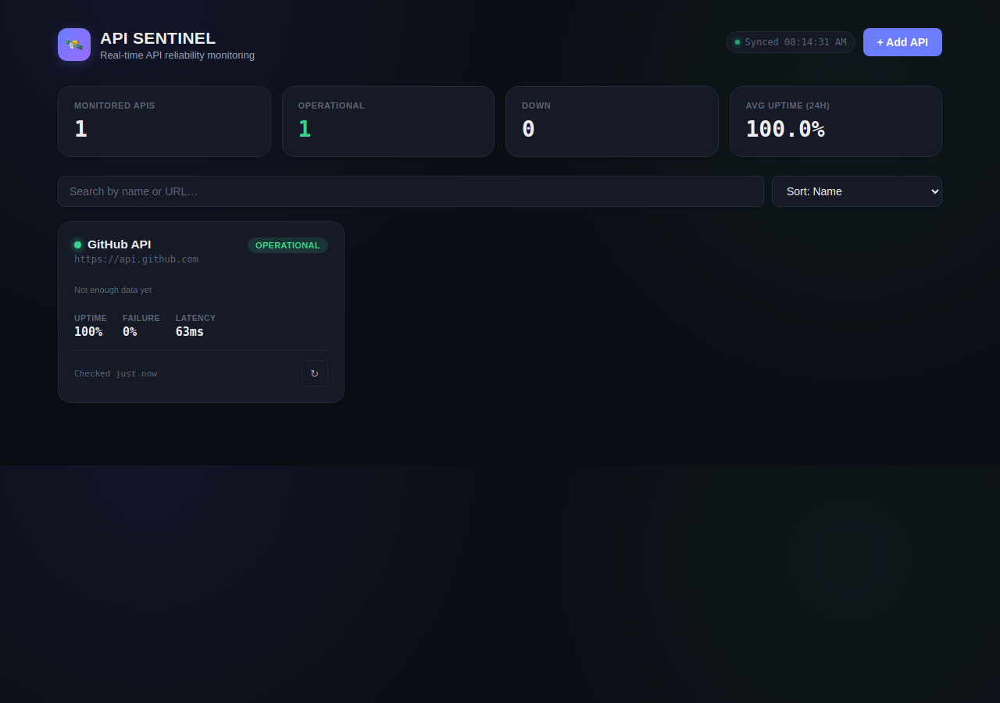
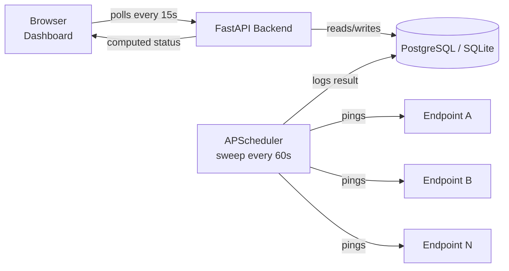

# 🛰️ API Sentinel

**A real-time API reliability monitoring platform** — track uptime, latency, and failure rates for any set of endpoints from a single live dashboard.


---

## Overview

Production systems depend on APIs staying up and fast — payment gateways, third-party integrations, internal microservices. API Sentinel is a self-hosted monitoring tool that **independently verifies endpoint health on a schedule**, rather than trusting an endpoint's own status page or waiting for a user to report a problem.

Add any URL, and a background scheduler pings it every 60 seconds, recording response time, HTTP status code, and success/failure. The dashboard shows live status, 24-hour uptime percentage, failure rate, and a response-time trend per endpoint — the same core pattern used by tools like UptimeRobot or Pingdom, built from scratch.

## Screenshot


*(Replace with your own screenshot after running it — see "Local Development" below.)*

## How to explain this project in an interview

> "API Sentinel is a full-stack monitoring platform — a background job checks a set of API endpoints every 60 seconds, logs response time and status code to a database, and a React dashboard shows live uptime, failure rate, and latency trends. The core idea is that monitoring has to run independently of anyone looking at the dashboard, so it's built around a scheduled background job rather than a typical request/response flow."

If pushed further: the interesting design decisions are (1) uptime % is computed live from a rolling 24-hour log rather than stored as a running counter, avoiding a separate cleanup job, and (2) the backend and frontend are deployed independently — FastAPI on Render (a persistent process, needed because the scheduler must keep running), and React on Vercel (static hosting) — which mirrors how real teams split a monitoring service from its dashboard.

## Features

- 🟢 **Live status dashboard** — searchable, sortable, at-a-glance health for every monitored API
- ⏱️ **Scheduled health checks** — background sweep every 60s via APScheduler, independent of the frontend being open
- 📊 **Uptime & failure-rate analytics** — rolling 24-hour metrics computed from persisted check history
- 📈 **Response-time sparklines + full trend chart** — per-endpoint latency at a glance and in detail
- 🔔 **Toast notifications & confirm dialogs** — clear feedback on every action, no silent failures
- 🔍 **Search & sort** — filter by name/URL, sort by status, uptime, or latency
- ↻ **Manual "check now"** — force an immediate re-check from the card or detail view
- 🐳 **One-command local deployment** — full stack via Docker Compose
- ☁️ **Production-ready deploy config** — Render blueprint + Vercel config included

## Tech Stack

| Layer      | Technology                          |
|------------|--------------------------------------|
| Frontend   | React, Vite, Recharts, Axios         |
| Backend    | FastAPI, APScheduler                 |
| Database   | PostgreSQL (prod) / SQLite (local default), via SQLAlchemy ORM |
| Local dev  | Docker Compose                       |
| Deployment | Vercel (frontend) + Render (backend + Postgres) |

## Architecture



The scheduler runs **inside the same backend process**, independent of any HTTP request — this is why the backend must be deployed somewhere that keeps a process alive (Render), not a serverless platform (Vercel functions spin down between requests and would kill the scheduler).

## Local Development

### Option A — Docker (recommended, matches production topology)

**Prerequisite:** [Docker Desktop](https://www.docker.com/products/docker-desktop) running.

```bash
git clone https://github.com/anu091104/api-sentinel.git
cd api-sentinel
docker compose up --build
```

- Dashboard → [http://localhost:5173](http://localhost:5173)
- API docs (Swagger) → [http://localhost:8000/docs](http://localhost:8000/docs)

### Option B — Native (no Docker), works in any VS Code terminal

**Backend**
```bash
cd backend
python -m venv venv
source venv/bin/activate        # Windows: venv\Scripts\Activate.ps1
pip install fastapi uvicorn[standard] sqlalchemy apscheduler requests pydantic pydantic-settings python-dotenv
uvicorn app.main:app --reload
```
No `DATABASE_URL` needed — it defaults to a local SQLite file (`sentinel.db`). To use Postgres instead, set `DATABASE_URL` before running (see `.env.example`).

> **Note on `psycopg2-binary`:** it's in `requirements.txt` for Postgres support, but isn't needed for local SQLite use. If installing the full `requirements.txt` fails on a very new Python version (no prebuilt wheel yet), just install the packages listed above instead — that's exactly what the command above does.

**Frontend** (new terminal)
```bash
cd frontend
npm install
npm run dev
```
Open [http://localhost:5173](http://localhost:5173).

## Deployment (Vercel + Render)

The frontend and backend deploy **separately** — this is intentional, not a workaround: static sites (Vercel) and long-running processes (Render) are different hosting models, and a monitoring scheduler needs the latter.

### 1. Deploy the backend to Render

**Fastest path — Blueprint:**
1. Push this repo to GitHub.
2. In Render, click **New → Blueprint**, and point it at your repo. Render reads `render.yaml` at the root and provisions both the web service and a free Postgres database automatically, wiring `DATABASE_URL` for you.
3. Once deployed, copy the service URL (e.g. `https://api-sentinel-backend.onrender.com`).

**Manual path (if you'd rather not use the blueprint):**
1. **New → Web Service**, connect your repo, set **Root Directory** to `backend`.
2. Build command: `pip install -r requirements.txt`
3. Start command: `uvicorn app.main:app --host 0.0.0.0 --port $PORT`
4. Add a Render Postgres database, and set the web service's `DATABASE_URL` env var to its connection string.
5. Leave `CORS_ORIGINS` unset for now — you'll set it after step 2 below.

### 2. Deploy the frontend to Vercel

1. In Vercel, **Add New → Project**, import the same repo, set **Root Directory** to `frontend`.
2. Vercel auto-detects Vite (build command `npm run build`, output `dist`) — no changes needed.
3. Add an environment variable: `VITE_API_BASE` = your Render backend URL from step 1.
4. Deploy. Copy the resulting Vercel URL (e.g. `https://api-sentinel.vercel.app`).

### 3. Connect them

Go back to the Render backend's environment variables and set:
```
CORS_ORIGINS=https://api-sentinel.vercel.app
```
Redeploy the backend. Your dashboard at the Vercel URL will now talk to the Render backend, with CORS locked to just that origin.

### Notes on the free tiers

- Render's free web services spin down after inactivity and take ~30–60s to wake on the next request — the scheduler pauses while asleep. Fine for a portfolio demo; a paid instance keeps it always-on for real use.
- Render's free Postgres expires after a set period of inactivity per Render's current policy — check Render's dashboard for the current terms if this sits unused for a long time.

## Environment Variables

| Variable | Where | Default | Purpose |
|---|---|---|---|
| `DATABASE_URL` | backend | `sqlite:///./sentinel.db` | DB connection string. Render/Docker use Postgres; local native defaults to SQLite. |
| `CORS_ORIGINS` | backend | `*` | Comma-separated allowed frontend origins. Set to your exact Vercel URL in production. |
| `SWEEP_INTERVAL_SECONDS` | backend | `60` | How often the scheduler checks all active endpoints. |
| `REQUEST_TIMEOUT_SECONDS` | backend | `10` | Timeout per health check request. |
| `VITE_API_BASE` | frontend | `http://localhost:8000` | Backend URL the dashboard talks to. |

See `backend/.env.example` and `frontend/.env.example`.

## API Reference

| Method | Endpoint                  | Description                        |
|--------|----------------------------|-------------------------------------|
| POST   | `/apis`                   | Register a new API to monitor (fires an immediate check) |
| GET    | `/apis`                   | List all APIs with live status, uptime, and sparkline data |
| GET    | `/apis/summary`           | Aggregate counts (operational / down / avg uptime) |
| GET    | `/apis/{id}`               | Single endpoint status              |
| PATCH  | `/apis/{id}`               | Update config / pause monitoring    |
| DELETE | `/apis/{id}`               | Stop monitoring, deletes history    |
| GET    | `/apis/{id}/history`       | Recent health-check records         |
| POST   | `/apis/{id}/check-now`     | Force an immediate check            |

Full interactive docs at `/docs` once the backend is running.

## Project Structure

```
api-sentinel/
├── backend/
│   ├── app/
│   │   ├── main.py         # FastAPI routes
│   │   ├── models.py       # SQLAlchemy models
│   │   ├── schemas.py      # Pydantic schemas
│   │   ├── crud.py         # DB ops, uptime calc, sparkline data
│   │   ├── scheduler.py    # APScheduler health-check sweep
│   │   ├── database.py     # DB engine/session, sqlite+postgres handling
│   │   └── config.py       # Env-driven settings (CORS, intervals, DB)
│   ├── requirements.txt
│   ├── Dockerfile
│   └── .env.example
├── frontend/
│   └── src/
│       ├── App.jsx             # Polling, search/sort, toasts, connection state
│       ├── context/ToastContext.jsx
│       └── components/
│           ├── Dashboard.jsx
│           ├── ApiCard.jsx
│           ├── Sparkline.jsx
│           ├── AddApiModal.jsx
│           ├── DetailModal.jsx
│           ├── ConfirmDialog.jsx
│           ├── SkeletonCard.jsx
│           └── ResponseTimeChart.jsx
│   ├── vercel.json
│   └── .env.example
├── render.yaml              # One-click Render blueprint
├── docker-compose.yml
└── README.md
```

## Known Limitations

Being upfront about current scope rather than overselling it:

- **Single global sweep interval** (60s) rather than true per-endpoint scheduling — `check_interval_seconds` exists in the schema for future use but isn't wired to individual job intervals yet.
- **No authentication** — anyone with the backend URL can add/remove monitored endpoints. Fine for a personal/portfolio deployment, not for public multi-tenant use. (See "Extending this project" below for how JWT auth would slot in.)
- **No alerting** (email/Slack/webhook) on downtime yet — the dashboard is the current signal.
- **History endpoint** uses a simple `limit` param rather than full pagination — adequate at current data volumes.

## Extending this project

- **Alerting** — email/Slack/webhook notification on status change (up → down)
- **JWT authentication** — a `users` table, password hashing, a login endpoint issuing signed tokens, and a FastAPI dependency protecting `/apis/*` routes, scoping endpoints to `user_id`
- **Per-endpoint scheduling** — a dedicated job per endpoint instead of one global sweep
- **Incident timeline** — notes/postmortems attached to downtime periods

## License

MIT — free to use, modify, and build on.
